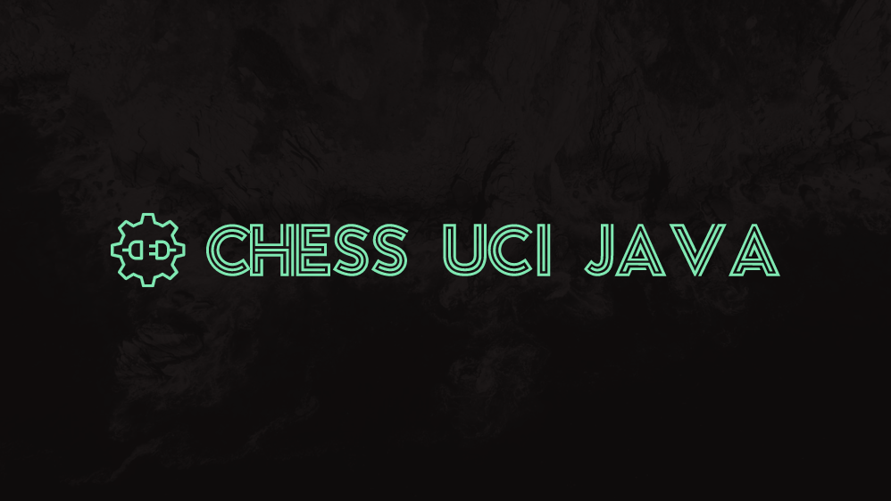

[](https://codecov.io/gh/FrequentlyMissedDeadlines/Chuck-Norris-Chess)

[]()
[](https://github.com/tterb/atomic-design-ui/blob/master/LICENSEs)
# Description

This is a Java library to handle UCI Chess Protocol. Add this dependency to your chess engine and it will be usable in most Chess GUI:
* [Chess Arena](http://www.playwitharena.de/)
* [Shredder](https://www.shredderchess.com/)
* [Fritz](https://en.wikipedia.org/wiki/Fritz_(chess))
* [And many others...](https://www.chessprogramming.org/UCI#GUIs)

It is made to be really easy to be used (see examples after):
- You just need to code small simple callback functions.
- No blocking call nor crazy `Thread` stuff to deal with: instantiating the `UciProtocol` will make it run in its standalone `Thread` that will call back your methods when needed.
- Simple API
    - 4 methods to be written
        - 1 to say your name (one liner)
        - 1 to say your engine name (one liner)
        - 2 to handle your moves and the opponent moves
    - 4 advanced methods if you want to make smart stuff with UCI options (not mandatory)
- No esoteric dependencies, you just need Java 8+

Under the hood, the UCI protocol is handled by a standalone  that will call your callback functions when needed.

# Usage example
## If you are lazy
A default behavior is already provided for advanced features so you just need to implement these 4 methods:
```java
public class UciListenerExample implements UciListener {

    @Override
    public String getEngineName() {
        return "Awesome Engine v1.0.0";
    }

    @Override
    public String getAuthorName() {
        return "Someone Cool";
    }

    @Override
    public void setPosition(String initialPosition, String[] moves) {
        // Just keep the information of the game from its FEN starting position and
        // the moves that have been done.
    }

    @Override
    public String go(GoParameters parameters) {
        // Based on the information stored in previous method and the GoParameters
        // it's here that you will call the logic of your engine to compute next move
        return "e2e4";
    }
}
```

## Advanced mode
If you want you can use advanced UCI features like options or be notified when a GUI is requesting an instance of your Engine.

```java
public class UciListenerExample implements UciListener {

    /**
     * This method is called when a GUI get connected to your Chess Engine
     */
    @Override
    public void onConnection() {
        
    }

    /**
     * Return your Chess Engine Name. It may be displayed in the GUI.
     *
     * @return chess engine name
     */
    @Override
    public String getEngineName() {
        return null;
    }

    /**
     * Return your name. It may be displayed in the GUI.
     *
     * @return your name
     */
    @Override
    public String getAuthorName() {
        return null;
    }

    /**
     * List all options that are supported by your engine. The GUI will send you back their values if they are supported.
     * For example:
     * <ul>
     *     <li>name NalimovPath type string default <empty></li>
     *     <li>name ClearHash type button</li>
     *     <li>name Nullmove type check default true</li>
     * </ul>
     * More details <a href="http://wbec-ridderkerk.nl/html/UCIProtocol.html">in the specs</a>.
     *
     * @return list of options supported by the engine
     */
    @Override
    public Iterable<String> listSupportedOptions() {
        return null;
    }

    /**
     * This method is called when an option value is returned by the GUI. Feel free to use it or not in your Engine.
     * Example value: <code>name NalimovCache value 32</code>
     *
     * @param option option name and value
     */
    @Override
    public void setOptionValue(String option) {

    }

    /**
     * This method is called to synchronize the GUI with your engine in case it provided some input that could be long to process by
     * the engine. If you are ready to proceed, simply return;
     */
    @Override
    public void getReady() {

    }

    /**
     * This method is called when the position has changed. It provides the initial position and all moves done from it.
     *
     * @param initialPosition the initial position in <a href="https://en.wikipedia.org/wiki/Forsyth%E2%80%93Edwards_Notation">FEN notation</a>
     * @param moves           an array of String containing all moves done from the starting position. The moves are in origin-destination notation.
     *                        For example:
     *                        <ul>
     *                        <li>
     *                            e2e4
     *                        </li>
     *                        <li>
     *                            e5e7
     *                        </li>
     */
    @Override
    public void setPosition(String initialPosition, String[] moves) {

    }

    /**
     * This method is called to tell the engine it should search for a move to play. Once it found one, it must
     * return it as a origin-destination String.
     *
     * @param parameters the search parameters
     * @return
     */
    @Override
    public String go(GoParameters parameters) {
        return null;
    }
}
```

# Credits
- Logo made thanks to [brandbuilder](https://brandbuilder.ai/).
